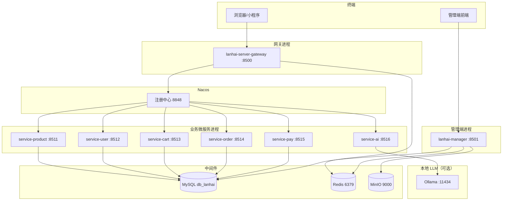
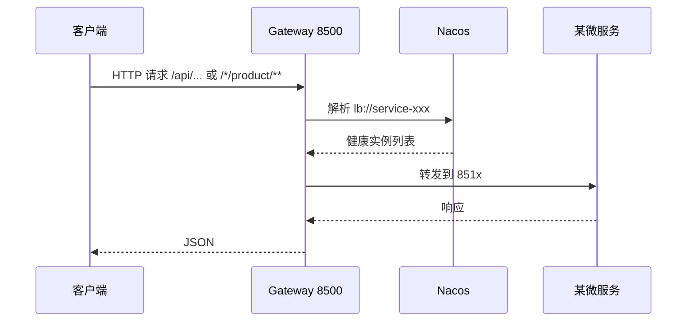

# 课时 01：项目总览与架构

## 学习目标

读完本课，你应能独立完成以下任务：

1. **用一段话**向面试官说明 **蓝海商城（lanhai）** 的业务目标与技术边界。  
2. **默写或画出** C 端请求从浏览器到 **具体微服务** 的路径（含 **网关、Nacos**）。  
3. 解释 **管理端（manager）** 与 **C 端微服务** 在 **入口、端口、鉴权** 上的差异。  
4. 说出 **开发环境各进程端口**（见 §3 端口总表，含可选 **service-ai / Ollama**），并说明 **为何需要这么多进程**。  
5. 对比 **单体商城** 与 **微服务商城** 在 **运维、开发、故障隔离** 上的权衡。

---

## 1. 项目定位与命名

### 1.1 项目名称与包结构

- **工程 Maven 坐标**：`com.liyiwei:lanhai:1.0-SNAPSHOT`。  
- **Java 包根**：`com.liyiwei.lanhai`，其下按 **网关 / 各服务 / 管理端 / common** 分包，便于 **IDE 导航** 与 **职责隔离**。

### 1.2 业务定位（简历可用表述）

**蓝海商城** 是一套面向 **B2C 场景** 的后端实现：用户可 **浏览商品、管理购物车、下单、使用支付宝支付**；运营人员通过 **后台管理端** 维护 **商品分类、用户与权限、文件资源** 等。  
技术实现上采用 **微服务拆分 + 统一网关 + 注册中心**，用于展示 **分布式协作、中间件使用与电商常见模块** 的工程能力。

### 1.3 技术栈清单（建议背熟）

| 类别 | 技术选型 | 说明 |
|------|----------|------|
| 语言 / 运行时 | Java **17** | 与 Spring Boot 3 官方支持一致 |
| 基础框架 | **Spring Boot 3.0.5** | 父工程继承 `spring-boot-starter-parent` |
| 微服务 | **Spring Cloud 2022.0.2** | Gateway、OpenFeign、LoadBalancer 等 |
| 阿里生态 | **Spring Cloud Alibaba**（如 **2022.0.0.0-RC2**） | **Nacos** 服务发现 |
| 网关 | **Spring Cloud Gateway** | 基于 **WebFlux**，**响应式** 栈 |
| 持久层 | **MyBatis** + **PageHelper** | XML Mapper 路径各服务可配 |
| 缓存 | **Redis** | 网关鉴权、业务缓存等 |
| 消息 / 注册 | **Nacos** | 默认 **8848** |
| 支付 | **支付宝开放平台 SDK** | 异步通知验签、下单参数拼装 |
| 对象存储 | **MinIO** | 管理端上传，**S3 兼容 API** |
| API 文档 | **Knife4j**（OpenAPI3） | 文档标题在 common 中配置为「蓝海商城 API」 |

---

## 2. 逻辑架构（多图）

### 2.1 进程与中间件关系

### 2.2 C 端一次请求的路径（概念）

**要点**：客户端 **不直接** 记各服务端口 **8511～8516**；**统一访问 8500**（网关），由 **路由规则** 决定转发目标。

---

## 3. 开发环境端口总表（以 `application-dev.yml` 为准）

以下摘自当前仓库 **源码** `src/main/resources/application-dev.yml`（若你本地改过端口，以你为准）：

| 进程 | 模块 | 端口 | spring.application.name（典型） |
|------|------|------|--------------------------------|
| 网关 | lanhai-server-gateway | **8500** | lanhai-server-gateway |
| 管理端 | lanhai-manager | **8501** | （见 manager 配置） |
| 商品 | service-product | **8511** | service-product |
| 用户 | service-user | **8512** | service-user |
| 购物车 | service-cart | **8513** | service-cart |
| 订单 | service-order | **8514** | service-order |
| 支付 | service-pay | **8515** | service-pay |
| AI 助手（Ollama 转发） | service-ai | **8516** | service-ai |

**中间件常见端口**：MySQL **3306**、Redis **6379**、Nacos **8848**、MinIO **9000**（API）/ **9001**（Console，若启用）。**本地大模型**：**Ollama** 默认 **11434**（仅在使用 **service-ai** 时需要）。

---

## 4. 用户侧 vs 管理端

| 维度 | C 端（经网关） | 管理端（manager） |
|------|----------------|-------------------|
| **入口** | `http://localhost:8500` + 路由前缀 | 通常直连 **`http://localhost:8501`** |
| **鉴权** | 网关 **`AuthGlobalFilter`**，路径 **`/api/**/auth/**`** 需 **Header: token** + Redis | **登录拦截器 + 白名单**，见 manager 的 `lanhai.auth.noAuthUrls` |
| **技术栈** | Gateway **WebFlux** | 传统 **Spring MVC** |
| **典型用途** | 购物、下单、支付 | 类目、用户角色、上传图片 |

**面试表述**：「C 端走 **网关统一鉴权**；后台是 **独立应用**，权限模型更贴近 **RBAC**，不混在同一套 Filter 里。」

---

## 5. 与单体商城的对比（深入）

| 维度 | 单体 Spring Boot | 本项目（微服务） |
|------|------------------|------------------|
| **部署** | 一个 jar | 网关 + 管理端 + 多业务服务（含可选 **service-ai**），**至少 7～8 个可运行 jar**（按是否启用 AI 而定） |
| **配置** | 一份 `application.yml` | **每服务一份**，易 **不一致**（需规范或配置中心） |
| **调试** | 单进程断点 | 需 **分布式日志/链路 ID**（本项目若未接 SkyWalking，靠 **各服务日志**） |
| **事务** | 本地 `@Transactional` 覆盖多表 | **跨服务** 需 **分布式事务或最终一致** |
| **优点** | 简单、时延低 | **独立扩容**、**故障隔离**（如支付挂不一定拖死商品） |
| **缺点** | 扩展粒度粗 | **联调成本高**、**运维复杂** |

---

## 6. 源码导航（第一遍只需知道路径）

| 内容 | 路径提示 |
|------|----------|
| 网关启动类 | `lanhai-server-gateway/.../GatewayApplication.java` |
| 全局鉴权 | `lanhai-server-gateway/.../filter/AuthGlobalFilter.java` |
| 网关路由配置 | `lanhai-server-gateway/.../application-dev.yml` → `spring.cloud.gateway.routes` |
| 各业务启动类 | `service-*/.../*Application.java` |
| 管理端启动类 | `lanhai-manager/.../ManagerApplication.java` |

---

## 7. 易错点（面试与实操）

| 误区 | 正解 |
|------|------|
| 「微服务一定比单体快」 | 多一次 **网络跳转**；**吞吐**未必更高，优势在 **扩展与边界** |
| 「网关做了所有权限」 | 网关多为 **登录态**；**按钮级权限** 常在 **服务内或管理端** |
| 「Nacos 只是配置中心」 | 本项目主要用 **服务发现**；配置中心能力 **可按需启用** |

---

## 8. 本课小结

- **lanhai** = **电商业务** + **Spring Cloud 工程化**；**端口表**与 **架构图** 是面试白板的基础。  
- **C 端经 8500**，**管理端 8501**，**中间件先起** 再启应用（详见课时 11）。

---

## 9. 自测与扩展

1. **默写** 网关、商品服务、订单服务、管理端 **四个端口**。  
2. **画** 一张图：从 **手机浏览器** 到 **order 服务** 经过哪些 **逻辑组件**（不要求画全类名）。  
3. **扩展阅读**：Spring Cloud Gateway 中 **`Predicate`** 与 **`Filter`** 的 **执行顺序**（官方文档 Filter 链）。
