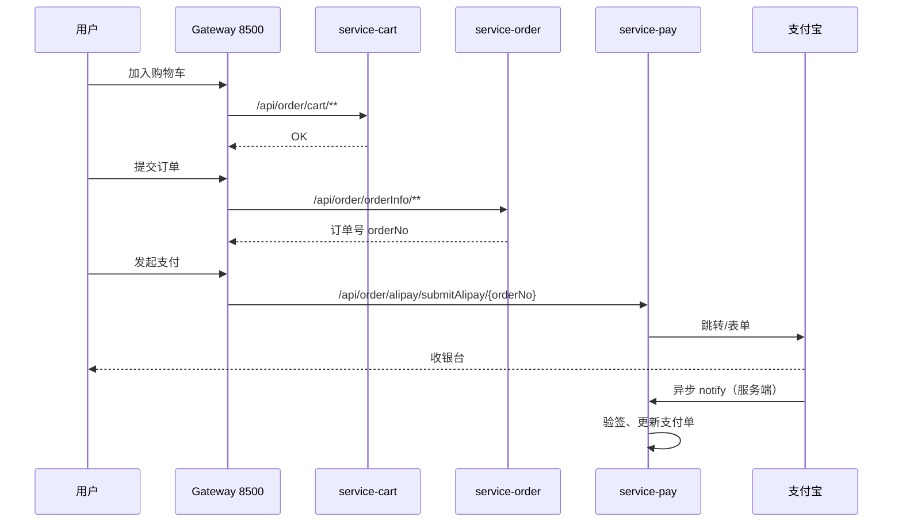

# 课时 07：订单与购物车链路

## 学习目标

1. 用 **时序图** 描述 **加购 → 下单 → 调起支付** 的 **逻辑顺序**（不要求背类名）。  
2. 对照 **Gateway `routes`**，说明 **购物车 / 订单 / 支付** 的 **URL 前缀** 如何 **落到不同服务**。  
3. 分析 **跨服务** 场景下的 **库存扣减** 有哪些 **实现策略**（乐观锁、MQ、Seata、本地消息表）。  
4. 区分 **同步调用链** 与 **异步通知**（支付回调）在 **一致性** 上的角色。  
5. 能向面试官说明 **本项目** 在 **一致性** 上 **做到哪一步**、**未做哪一步**（诚实）。

---

## 1. 网关路径与服务的映射（再巩固）

| 业务 | Gateway Path Predicate（摘自配置） | 目标服务 |
|------|-------------------------------------|----------|
| 购物车 | `/api/order/cart/**` | **service-cart** |
| 订单 | `/api/order/orderInfo/**` | **service-order** |
| 支付宝 | `/api/order/alipay/**` | **service-pay** |

**注意**：`Path` 里带 **`order`** 前缀是 **URL 设计**，**不是** 所有请求都进 **order 服务** —— **cart / pay** 有 **独立路由**。

---

## 2. 典型业务时序（简化）

**说明**：**同步返回** 与 **支付结果** 的 **最终一致** 依赖 **异步 notify**；**前端同步 return** 仅作展示。

---

## 3. 跨服务与一致性（面试深挖）

### 3.1 创建订单时扣库存

| 方案 | 思路 | 适用 |
|------|------|------|
| **同步 RPC** | order 调 product **扣库存** API | 简单、**强一致** 难 |
| **TCC / Seata** | Try-Confirm-Cancel | **金融级** 一致性 |
| **本地消息表 + MQ** | order **落库消息**，**异步** 扣库存 | **最终一致** |
| **Redis 预扣 + 超时释放** | **秒杀** 常用 | 与 **DB** 对账 |

**回答模板**：「我们项目若 **同库**，可能 **事务内** 更新；若 **分库**，会倾向 **最终一致** 或 **Seata**，视量级与风险。」

### 3.2 重复请求与幂等

- **下单**：**订单号**、**幂等键**（前端传 **clientToken**）防 **双击提交**。  
- **支付回调**：**支付宝 out_trade_no** + **业务幂等** 防 **重复入账**。

---

## 4. Feign 在链路中的位置

若 **order** 需调 **product** 或 **user**，则通过 **`service-xxx-client`**：  
**「order 服务进程」** 内 **注入 Feign 接口** → **HTTP** → **Nacos 解析** → **product 服务**。

**调试**：**链路** 分散在 **多个日志文件**；可引入 **TraceId**（MDC）或 **SkyWalking**（扩展）。

---

## 5. 易错点

| 现象 | 可能原因 |
|------|----------|
| 购物车有，订单创建失败 | **库存不足**、**价格变更**、**并发** |
| 订单已建，支付失败 | **支付宝配置**、**签名**、**订单金额** 不一致 |
| notify 多次 | **支付宝重试**；**必须幂等** |

---

## 6. 本课小结

- **路径** 决定 **流量进哪个服务**；**业务规则** 决定 **数据如何一致**。  
- **支付** 以 **异步回调** 为准，是 **电商常识**。

---

## 7. 自测与扩展

1. **走通** Swagger：购物车 → 下单 → 支付（沙箱），**记录** 每一步 **URL**。  
2. 阅读 **OrderInfoServiceImpl**（或同类）中 **创建订单** 的 **事务边界**。  
3. **扩展**：阅读 **RocketMQ** 事务消息 **与** 本地消息表 **对比**。
