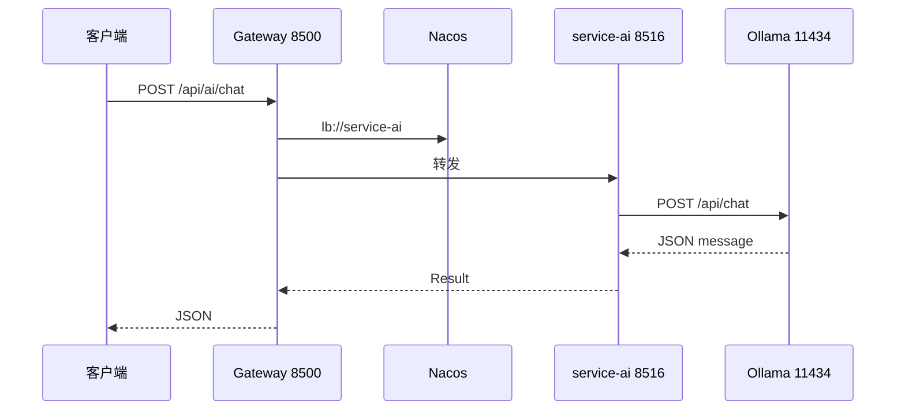

# 课时 13：AI 助手与 Ollama 接入

## 学习目标

1. 说明 **为何单独拆出 `service-ai`**，而不是在某一业务服务里直接调 Ollama。  
2. 能画出 **浏览器 / 客户端 → Gateway → service-ai → Ollama** 的请求路径，并写出 **端口与路径**。  
3. 在源码中定位 **`OllamaChatService`**、`lanhai.ollama.*` 配置，以及 **网关** 里转发 **`/api/ai/**`** 的那条 route。  
4. 说明 **`/api/ai/**` 是否走网关登录校验**（与 `AuthGlobalFilter` 的路径规则关系）。  
5. 独立完成 **本机 Ollama 前置条件** 与 **`curl` 联调**；能根据现象排查 **连接拒绝、模型不存在**。

---

## 1. 模块定位

**`service-ai`** 是一个 **可选** 的微服务，职责很单一：

- 接收 **HTTP JSON**（用户问题、可选模型名）。  
- 使用 **`RestTemplate`** 调用本机 **Ollama** 的 **`POST /api/chat`**（**非流式**，`stream: false`）。  
- 把返回 JSON 里的 **`message.content`** 取出，再封装成项目统一的 **`Result`** 返回。

**为何单独成服务**（面试可答）：

- **边界清晰**：AI 能力与 **商品 / 订单** 等业务解耦，升级模型或换推理方式时不牵一发而动全身。  
- **资源隔离**：大模型推理 **耗 CPU/GPU**，将来可 **单独扩缩容** 或 **限流**。  
- **依赖简单**：不污染核心业务库；本实现用 **H2 内存库** 仅满足父 POM 下 **DataSource / MyBatis** 的自动配置（无真实业务表）。

---

## 2. 请求路径与端口



| 访问方式 | URL 示例 | 说明 |
|----------|----------|------|
| **经网关（推荐联调 C 端）** | `http://localhost:8500/api/ai/chat` | 需 **Gateway + Nacos + service-ai** 已启动 |
| **直连微服务** | `http://localhost:8516/api/ai/chat` | 绕过网关，仅本地调试 |

**Ollama 默认地址**：`http://127.0.0.1:11434`（可在配置中改 **`lanhai.ollama.base-url`**）。

---

## 3. 配置说明（`service-ai`）

配置文件：`lanhai-service/service-ai/src/main/resources/application-dev.yml`（以 **`spring.profiles.active: dev`** 为准）。

| 配置前缀 | 典型项 | 含义 |
|----------|--------|------|
| `server.port` | **8516** | 微服务监听端口 |
| `spring.application.name` | **service-ai** | **Nacos 注册名**，须与网关 **`lb://service-ai`** 一致 |
| `lanhai.ollama` | `base-url`、`model`、`connect-timeout-ms`、`read-timeout-ms` | **Ollama 根地址**、**默认模型**、超时 |

**模型名**：须与本机已拉取的模型一致，例如配置为 **`llama3.2`** 时，本机应能 **`ollama list`** 看到同名；否则 Ollama 会报错。

---

## 4. 网关路由

文件：`lanhai-server-gateway/src/main/resources/application-dev.yml`

- **`id`**: `service-ai`  
- **`uri`**: `lb://service-ai`  
- **`Path`**: `/api/ai/**`  

因此 **凡是以 `/api/ai/` 开头的路径**（如 **`/api/ai/chat`**、**`/api/ai/ping`**）都会转发到 **service-ai**。

---

## 5. 鉴权：是否必须登录？

网关 **`AuthGlobalFilter`** 仅对匹配 **`/api/**/auth/**`** 的路径做 **token + Redis** 校验。

- **`/api/ai/chat`** **不匹配** 上述模式 → **当前实现下经网关调用 AI 不要求登录**。  

若产品要求 **仅登录用户可用购物助手**，需要在网关 **增加白名单/黑名单规则**，或在 **service-ai** 内 **校验 token**——属于后续迭代，本课只说明 **现状**。

---

## 6. 源码导航（第一遍抓主类即可）

| 内容 | 路径 |
|------|------|
| 启动类 | `service-ai/.../AiApplication.java` |
| HTTP 接口 | `service-ai/.../controller/AiChatController.java`（如 **`POST /api/ai/chat`**） |
| Ollama 调用 | `service-ai/.../service/OllamaChatService.java` |
| 配置属性 | `service-ai/.../config/OllamaProperties.java` |
| `RestTemplate` | `service-ai/.../config/RestTemplateConfig.java` |

**Ollama 官方 API 说明**（请求体字段、`/api/chat` 等）：见 [Ollama API 文档](https://github.com/ollama/ollama/blob/main/docs/api.md)。

---

## 7. 本机前置条件

1. 安装并启动 **Ollama**（Windows / macOS / Linux 官方安装包即可）。  
2. 执行 **`ollama serve`**（部分安装方式会作为 **系统服务** 自动拉起）。  
3. **`ollama pull <模型名>`**，且与 **`lanhai.ollama.model`** **一致**。  
4. 启动 **Nacos**、**Redis**，再启动 **service-ai**（及 **Gateway** 若走 **8500**）。

---

## 8. 联调示例（`curl`）

```bash
curl -s -X POST "http://localhost:8500/api/ai/chat" ^
  -H "Content-Type: application/json" ^
  -d "{\"message\":\"用一句话介绍蓝海商城\"}"
```

（Linux / macOS 把 `^` 换行改为 `\`。）

可选：请求体里加 **`"model":"qwen2.5"`** 等字段可 **临时覆盖** 默认模型（以 **`AiChatController`** 实现为准）。

---

## 9. 排错简表

| 现象 | 可能原因 |
|------|----------|
| **503 / No instances** | **service-ai** 未启动或未注册 **Nacos** |
| **连接被拒绝 11434** | **Ollama** 未运行或 **`base-url` 错误** |
| **模型不存在 / 404** | **模型名** 与 **`ollama list`** 不一致 |
| **长时间无响应** | 模型过大或机器资源不足；可调大 **`read-timeout-ms`** |

---

## 10. 本课小结

- **`service-ai`** = **薄代理层**，把 **统一商城接口** 与 **本机 Ollama** 隔开，便于 **独立演进与运维**。  
- **网关 `Path=/api/ai/**`** + **`lb://service-ai`** = C 端 **统一入口**；**直连 8516** 仅作调试。  
- **鉴权** 当前 **未绑定登录**；若需 **强制登录**，要 **额外设计**。

---

## 11. 自测与扩展

1. 在 Nacos 控制台确认 **`service-ai`** 实例 **健康**。  
2. 用 **`curl`** 同时测 **8500** 与 **8516**，对比响应是否一致。  
3. **扩展**：阅读 Ollama **`/api/chat` 流式** 返回格式，思考若要在前端 **打字机效果**，网关与服务应如何改（**SSE / WebSocket**）。
